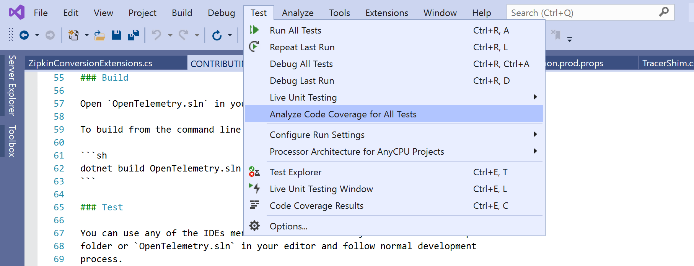

# Contributing to opentelemetry-dotnet

The OpenTelemetry .NET special interest group (SIG) meets regularly. See the
OpenTelemetry [community](https://github.com/open-telemetry/community#net-sdk)
repo for information on this and other language SIGs.

See the [public meeting
notes](https://docs.google.com/document/d/1yjjD6aBcLxlRazYrawukDgrhZMObwHARJbB9glWdHj8/edit?usp=sharing)
for a summary description of past meetings. To request edit access, join the
meeting or get in touch on
[Gitter](https://gitter.im/open-telemetry/opentelemetry-dotnet).

Even though, anybody can contribute, there are benefits of being a member of
our community. See to the [community membership
document](https://github.com/open-telemetry/community/blob/master/community-membership.md)
on how to become a
[**Member**](https://github.com/open-telemetry/community/blob/master/community-membership.md#member),
[**Approver**](https://github.com/open-telemetry/community/blob/master/community-membership.md#approver)
and
[**Maintainer**](https://github.com/open-telemetry/community/blob/master/community-membership.md#maintainer).

## Find a Buddy and get Started Quickly

If you are looking for someone to help you find a starting point and be a
resource for your first contribution, join our Gitter and find a buddy!

1. Join [Gitter.im](https://gitter.im) and join our [chat
   room](https://gitter.im/open-telemetry/opentelemetry-dotnet).
2. Post in the room with an introduction to yourself, what area you are
   interested in (check issues marked with [good first
   issue](https://github.com/open-telemetry/opentelemetry-dotnet/labels/good%20first%20issue)
   or [help
   wanted](https://github.com/open-telemetry/opentelemetry-dotnet/labels/help%20wanted)),
   and say you are looking for a buddy. We will match you with someone who has
   experience in that area.

Your OpenTelemetry buddy is your resource to talk to directly on all aspects of
contributing to OpenTelemetry: providing context, reviewing PRs, and helping
those get merged. Buddies will not be available 24/7, but is committed to
responding during their normal contribution hours.

## Development

### Prerequisites

You can contribute to this project from a Windows, macOS or Linux machine.
Requirements can very slightly:

In all platforms, the requirements are:

* Git client and command line tools. You may use Visual Studio to clone the
  repo, but we use [SourceLink](https://github.com/dotnet/sourcelink) to build
  and it needs git.
* .NET Core 3.1+

#### Windows

* Visual Studio 2017+, VS Code or JetBrains Rider
* .NET Framework 4.6+

#### MacOS or Linux

* Visual Studio for Mac, VS Code or JetBrains Rider

Mono might be required by your IDE but is not required by this project. This is
because unit tests targeting .NET Framework (i.e: `net46`) are disabled outside
of Windows.

### Build

Open `OpenTelemetry.sln` in your IDE of choice and follow normal development
process.

To build from the command line you need `dotnet` version `3.1+`.

```sh
dotnet build OpenTelemetry.sln
```

### Test

You can use any of the IDEs mentioned above to test your contribution. Open
root folder or `OpenTelemetry.sln` in your editor and follow normal development
process.

To test from command line you need `dotnet` version `3.1+`.

```sh
dotnet test OpenTelemetry.sln
```

### Code Coverage

On Linux and macOS run `dotnet test` from a terminal window and you will see
the following output:


Or, after running the tests, open the file `TestResults\Results\index.htm` in a
browser.

On Windows use the `Analyze Code Coverage for All Tests` on Visual Studio
`Test` menu.



## Pull Requests

### How to Send Pull Requests

Everyone is welcome to contribute code to `opentelemetry-dotnet` via GitHub
pull requests (PRs).

To create a new PR, fork the project in GitHub and clone the upstream repo:

```sh
git clone https://github.com/open-telemetry/opentelemetry-dotnet.git
```

Add your fork as an origin:

```sh
git remote add fork https://github.com/YOUR_GITHUB_USERNAME/opentelemetry-dotnet.git
```

Run tests:

```sh
dotnet test
```

Check out a new branch, make modifications and push the branch to your fork:

```sh
$ git checkout -b feature
# edit files
$ git commit
$ git push fork feature
```

Open a pull request against the main `opentelemetry-dotnet` repo.

### How to Receive Comments

* If the PR is not ready for review, please put `[WIP]` in the title, tag it as
  `work-in-progress`, or mark it as
  [`draft`](https://github.blog/2019-02-14-introducing-draft-pull-requests/).
* Make sure CLA is signed and CI is clear.

### How to Get PRs Merged

A PR is considered to be **ready to merge** when:

* It has received approval from
  [Approvers](https://github.com/open-telemetry/community/blob/master/community-membership.md#approver).
  /
  [Maintainers](https://github.com/open-telemetry/community/blob/master/community-membership.md#maintainer).
* Major feedbacks are resolved.
* It has been open for review for at least one working day. This gives people
  reasonable time to review.
* Trivial change (typo, cosmetic, doc, etc.) doesn't have to wait for one day.
* Urgent fix can take exception as long as it has been actively communicated.

Any Maintainer can merge the PR once it is **ready to merge**. Note, that some
PR may not be merged immediately if repo is being in process of a major release
and the new feature doesn't fit it.

## Design Choices

As with other OpenTelemetry clients, opentelemetry-dotnet follows the
[opentelemetry-specification](https://github.com/open-telemetry/opentelemetry-specification).

It's especially valuable to read through the [library
guidelines](https://github.com/open-telemetry/opentelemetry-specification/blob/master/specification/library-guidelines.md).

### Focus on Capabilities, Not Structure Compliance

OpenTelemetry is an evolving specification, one where the desires and use cases
are clear, but the method to satisfy those uses cases are not.

As such, contributions should provide functionality and behavior that conforms
to the specification, but the interface and structure is flexible.

It is preferable to have contributions follow the idioms of the language rather
than conform to specific API names or argument patterns in the spec.

For a deeper discussion, see [this spec
issue](https://github.com/open-telemetry/opentelemetry-specification/issues/165).

## Style Guide

This project includes a
[`.editorconfig`](https://github.com/open-telemetry/opentelemetry-dotnet/blob/master/.editorconfig)
file which is supported by all the IDEs/editor mentioned above. It works with
the IDE/editor only and does not affect the actual build of the project.

This repository also includes [stylecop ruleset
files](https://github.com/open-telemetry/opentelemetry-dotnet/tree/master/build).
These files are used to configure the _StyleCop.Analyzers_ which runs during
build. Breaking the rules will result in a build failure.
