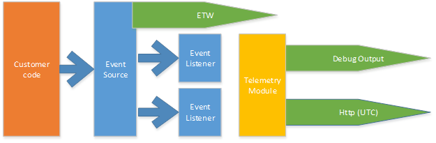

# Error logging

This document explains how Open Census SDK logs information about it's own
execution.

There are the following scenarios for SDK manageability:

1. Send error & warning logs to the back-end for customer self-troubleshooting.
2. Visualize OC SDK health in external tools.
3. Visualize OC SDK health in Z-Pages.
4. Show errors/warnings/information in Visual Studio F5 debug window.
5. Testing – no debugger troubleshooting.
6. Customer support – collect verbose logs.

## Definition of verbosity levels

The following severity levels are defined for SDK logs.

### Severity `Error`

Problem in SDK operation resulted in data loss or inability to collect data.

### Severity `Warning`

Problem in SDK operation that MAY result in data loss if not attended to.
`Warning` level may also identify data quality problem.

### Severity `Informational`

Major, most often rarely happening operation completion.

### Severity `Verbose`

All other logs. Typically used for troubleshooting of a hard to reproduce
issues or issues happening in specific production environments.

## Logging with EventSource

1. Find or create an assembly-specific `internal` class inherited from
   `EventSource`.
2. Prefix the name of EventSource with `OpenTelemetry-` using class attribute like
   this: `[EventSource(Name = "OpenTelemetry-Base")]`.
3. Create a new `Event` method with the arguments that needs to be logged. Each
   event should have index, message and event severity (level). It is a good
   practice to include event severity (level) into the method name.
4. Use the following rules to pick event index:
    1. Do not reorder existing event method indexes. Otherwise versioning of
       logs metadata will not work well.
    2. Do not put large gaps between indices. E.g. use sequential indices
       instead of events categorization based on index (`1X` for one category,
       `2X` for another). Unassigned indices in `1X` category will affect
       logging performance.
5. Use the following rules to author the event message:
    1. Make event description actionable and explain the effect of the problem.
       For instance, instead of *"No span in current context"* use something
       like *"No span in current context. Span name will not be updated. It may
       indicate incorrect usage of Open Census API - please ensure span wasn't
       overridden explicitly in your code or by other module."*
6. Use the following definition of the severity from the next section.
7. Follow the performance optimization techniques.

## Minimizing logging performance impact

### Pass object references

EventSource requires to use primitive types like `int` or `string` in `Write`
method. This limitation requires to format complex types like `Exception` before
calling trace statement.

Since formatting happens before calling `Write` method it will be called
unconditionally – whether listener enabled or not. To minimize performance hit
create `NonEvent` methods in EventSource that accept complex types and check
`Log.IsEnabled` before serializing those and passing to `Event` methods.

### Diagnostics events throttling

Throttling is required for the following scenarios:

- Minimize traffic we use to report problems to portal
- Make sure *.etl are not overloaded with similar errors

Logs subscribers will implement throttling logic. However log producer may have
an additional logic to prevent excessive logging. For instance, if problem
cannot be resolved in runtime - producer of the `Error` log may decide to only
log it once or once in a while. Note, this technique should be used carefully
as not every log subscriber can be enabled from the process start and may miss
this important error message.

## Subscribing to EventSource

EventSource allows us to separate logic of tracing and delivering those traces
to different channels. Default ETW subscriber works out of the box. For all
other channels in-process subscribers can be used for data delivery.

## EventSource vs. using SDK itself

1. No support for `IsEnabled` when exporter/listener exists. It's important for
   verbose logging.
2. ETW channel is not supported.
3. In-process subscription/extensibility is not supported.
4. Logging should be more reliable then SDK itself.
