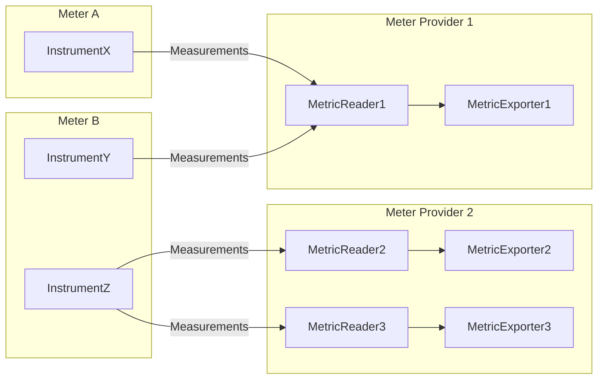
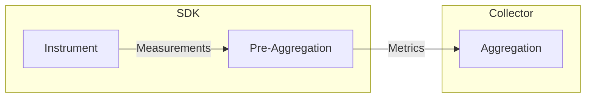
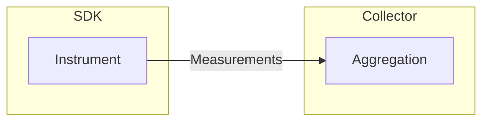

# OpenTelemetry .NET Metrics

## Best Practices

The following tutorials have demonstrated the best practices for while using
metrics with OpenTelemetry .NET:

* [Getting Started - ASP.NET Core
  Application](./getting-started-aspnetcore/README.md)
* [Getting Started - Console Application](./getting-started-console/README.md)

## Package Version

:heavy_check_mark: You should always use the
[System.Diagnostics.Metrics](https://learn.microsoft.com/dotnet/api/system.diagnostics.metrics)
APIs from the latest stable version of
[System.Diagnostics.DiagnosticSource](https://www.nuget.org/packages/System.Diagnostics.DiagnosticSource/)
package, regardless of the .NET runtime version being used:

* If you're using the latest stable version of [OpenTelemetry .NET
  SDK](../../src/OpenTelemetry/README.md), you don't have to worry about the
  version of `System.Diagnostics.DiagnosticSource` package because it is already
  taken care of for you via [package
  dependency](../../Directory.Packages.props).
* The .NET runtime team is holding a high bar for backward compatibility on
  `System.Diagnostics.DiagnosticSource` even during major version bumps, so
  compatibility is not a concern here.

## Metrics API

:heavy_check_mark: You should understand and pick the right instrument type.

  > [!NOTE]
  > .NET runtime has provided several instrument types based on the [OpenTelemetry
    Specification](https://github.com/open-telemetry/opentelemetry-specification/blob/main/specification/metrics/api.md#instrument).
    Picking the right instrument type for your use case is crucial to ensure the
    correct semantics and performance. Check the [Instrument
    Selection](https://github.com/open-telemetry/opentelemetry-specification/blob/main/specification/metrics/supplementary-guidelines.md#instrument-selection)
    section from the supplementary guidelines for more information.

  | OpenTelemetry Specification | .NET Instrument Type |
  | --------------------------- | -------------------- |
  | [Asynchronous Counter](https://github.com/open-telemetry/opentelemetry-specification/blob/main/specification/metrics/api.md#asynchronous-counter) | [`ObservableCounter<T>`](https://learn.microsoft.com/dotnet/api/system.diagnostics.metrics.observablecounter-1) |
  | [Asynchronous Gauge](https://github.com/open-telemetry/opentelemetry-specification/blob/main/specification/metrics/api.md#asynchronous-gauge) | [`ObservableGauge<T>`](https://learn.microsoft.com/dotnet/api/system.diagnostics.metrics.observablegauge-1) |
  | [Asynchronous UpDownCounter](https://github.com/open-telemetry/opentelemetry-specification/blob/main/specification/metrics/api.md#asynchronous-updowncounter) | [`ObservableUpDownCounter<T>`](https://learn.microsoft.com/dotnet/api/system.diagnostics.metrics.observableupdowncounter-1) |
  | [Counter](https://github.com/open-telemetry/opentelemetry-specification/blob/main/specification/metrics/api.md#counter) | [`Counter<T>`](https://learn.microsoft.com/dotnet/api/system.diagnostics.metrics.counter-1) |
  | [Gauge](https://github.com/open-telemetry/opentelemetry-specification/blob/main/specification/metrics/api.md#gauge) (experimental) | N/A |
  | [Histogram](https://github.com/open-telemetry/opentelemetry-specification/blob/main/specification/metrics/api.md#histogram) | [`Histogram<T>`](https://learn.microsoft.com/dotnet/api/system.diagnostics.metrics.histogram-1) |
  | [UpDownCounter](https://github.com/open-telemetry/opentelemetry-specification/blob/main/specification/metrics/api.md#updowncounter) | [`UpDownCounter<T>`](https://learn.microsoft.com/dotnet/api/system.diagnostics.metrics.updowncounter-1) |

:stop_sign: You should avoid creating instruments (e.g. `Counter<T>`) too
frequently. Instruments are fairly expensive and meant to be reused throughout
the application. For most applications, instruments can be modeled as static
readonly fields (e.g. [Program.cs](./getting-started-console/Program.cs)) or
singleton via dependency injection (e.g.
[Instrumentation.cs](../../examples/AspNetCore/Instrumentation.cs)).

:stop_sign: You should avoid invalid instrument names.

> [!NOTE]
> OpenTelemetry will not collect metrics from instruments that are using invalid
  names. Refer to the [OpenTelemetry
  Specification](https://github.com/open-telemetry/opentelemetry-specification/blob/main/specification/metrics/api.md#instrument-name-syntax)
  for the valid syntax.

:stop_sign: You should avoid changing the order of tags while reporting
measurements.

> [!WARNING]
> The last line of code has bad performance since the tags are not following
  the same order:

```csharp
counter.Add(2, new("name", "apple"), new("color", "red"));
counter.Add(3, new("name", "lime"), new("color", "green"));
counter.Add(5, new("name", "lemon"), new("color", "yellow"));
counter.Add(8, new("color", "yellow"), new("name", "lemon")); // bad perf
```

:heavy_check_mark: You should use TagList properly to achieve the best
performance.

There are two different ways of passing tags to an instrument API:

* Pass the tags directly to the instrument API:

  ```csharp
  counter.Add(100, ("Key1", "Value1"), ("Key2", "Value2"));
  ```

* Use
  [`TagList`](https://learn.microsoft.com/dotnet/api/system.diagnostics.taglist):

  ```csharp
  var tags = new TagList
  {
      { "DimName1", "DimValue1" },
      { "DimName2", "DimValue2" },
      { "DimName3", "DimValue3" },
      { "DimName4", "DimValue4" },
  };

  counter.Add(100, tags);
  ```

Here is the rule of thumb:

* When reporting measurements with 3 tags or less, pass the tags directly to the
  instrument API.
* When reporting measurements with 4 to 8 tags (inclusive), use
  [`TagList`](https://learn.microsoft.com/dotnet/api/system.diagnostics.taglist?#remarks)
  to avoid heap allocation if avoiding GC pressure is a primary performance
  goal. For high performance code which consider reducing CPU utilization more
  important (e.g. to reduce latency, to save battery, etc.) than optimizing
  memory allocations, use profiler and stress test to determine which approach
  is better.
  Here are some [metrics benchmark
  results](../../test/Benchmarks/Metrics/MetricsBenchmarks.cs) for reference.
* When reporting measurements with more than 8 tags, the two approaches share
  very similar CPU performance and heap allocation. `TagList` is recommended due
  to its better readability and maintainability.

> [!NOTE]
> When reporting measurements with more than 8 tags, the API allocates memory on
the hot-path. You SHOULD try to keep the number of tags less than or equal to 8.
If you are exceeding this, check if you can model some of the tags as Resource,
as [shown here](#modeling-static-tags-as-resource).

## MeterProvider Management

:stop_sign: You should avoid creating `MeterProvider` instances too frequently,
`MeterProvider` is fairly expensive and meant to be reused throughout the
application. For most applications, one `MeterProvider` instance per process
would be sufficient.



:heavy_check_mark: You should properly manage the lifecycle of `MeterProvider`
instances if they are created by you.

Here is the rule of thumb when managing the lifecycle of `MeterProvider`:

* If you are building an application with [dependency injection
  (DI)](https://learn.microsoft.com/dotnet/core/extensions/dependency-injection)
  (e.g. [ASP.NET Core](https://learn.microsoft.com/aspnet/core) and [.NET
  Worker](https://learn.microsoft.com/dotnet/core/extensions/workers)), in most
  cases you should create the `MeterProvider` instance and let DI manage its
  lifecycle. Refer to the [Getting Started with OpenTelemetry .NET Metrics in 5
  Minutes - ASP.NET Core Application](./getting-started-aspnetcore/README.md)
  tutorial to learn more.
* If you are building an application without DI, create a `MeterProvider`
  instance and manage the lifecycle explicitly. Refer to the [Getting Started
  with OpenTelemetry .NET Metrics in 5 Minutes - Console
  Application](./getting-started-console/README.md) tutorial to learn more.
* If you forget to dispose the `MeterProvider` instance before the application
  ends, metrics might get dropped due to the lack of proper flush.
* If you dispose the `MeterProvider` instance too early, any subsequent
  measurements will not be collected.

## Memory Management

In OpenTelemetry,
[measurements](https://github.com/open-telemetry/opentelemetry-specification/blob/main/specification/metrics/api.md#measurement)
are reported via the metrics API. The SDK
[aggregates](https://github.com/open-telemetry/opentelemetry-specification/blob/main/specification/metrics/sdk.md#aggregation)
metrics using certain algorithm and memory management strategy to achieve good
performance and efficiency. Here are the rules which OpenTelemetry .NET follows
while implementing the metrics aggregation logic:

1. **Pre-Aggregation**: aggregation occurs within the SDK.
2. **Cardinality Limits**: the aggregation logic respects [cardinality
   limits](https://github.com/open-telemetry/opentelemetry-specification/blob/main/specification/metrics/sdk.md#cardinality-limits),
   so the SDK does not use indefinite amount of memory when there is cardinality
   explosion.
3. **Memory Preallocation**: the memory used by aggregation logic is allocated
   during the SDK initialization, so the SDK does not have to allocate memory
   on-the-fly. This is to avoid garbage collection being triggered on the hot
   code path.

### Example

Let's take the following example:

* During the time range (T0, T1]:
  * value = 1, name = `apple`, color = `red`
  * value = 2, name = `lemon`, color = `yellow`
* During the time range (T1, T2]:
  * no fruit has been received
* During the time range (T2, T3]
  * value = 5, name = `apple`, color = `red`
  * value = 2, name = `apple`, color = `green`
  * value = 4, name = `lemon`, color = `yellow`
  * value = 2, name = `lemon`, color = `yellow`
  * value = 1, name = `lemon`, color = `yellow`
  * value = 3, name = `lemon`, color = `yellow`

If we aggregate the metrics as
[Sums](https://github.com/open-telemetry/opentelemetry-specification/blob/main/specification/etrics/data-model.md#sums)
and export the results using [Cumulative
Temporality](https://github.com/open-telemetry/opentelemetry-specification/blob/main/pecification/metrics/data-model.md#temporality):

* (T0, T1]
  * attributes: {name = `apple`, color = `red`}, count: `1`
  * attributes: {verb = `lemon`, color = `yellow`}, count: `2`
* (T1, T2]
  * attributes: {name = `apple`, color = `red`}, count: `1`
  * attributes: {verb = `lemon`, color = `yellow`}, count: `2`
* (T2, T3]
  * attributes: {name = `apple`, color = `red`}, count: `6`
  * attributes: {name = `apple`, color = `green`}, count: `2`
  * attributes: {verb = `lemon`, color = `yellow`}, count: `12`

If we aggregate the metrics as
[Sums](https://github.com/open-telemetry/opentelemetry-specification/blob/main/specification/etrics/data-model.md#sums)
and export the results using [Delta
Temporality](https://github.com/open-telemetry/opentelemetry-specification/blob/main/pecification/metrics/data-model.md#temporality):

* (T0, T1]
  * attributes: {name = `apple`, color = `red`}, count: `1`
  * attributes: {verb = `lemon`, color = `yellow`}, count: `2`
* (T1, T2]
  * nothing since we don't have any measurement received
* (T2, T3]
  * attributes: {name = `apple`, color = `red`}, count: `5`
  * attributes: {name = `apple`, color = `green`}, count: `2`
  * attributes: {verb = `lemon`, color = `yellow`}, count: `10`

### Pre-Aggregation

Taking the [fruit example](#example), there are 6 measurements reported during
`(T2, T3]`. Instead of exporting every individual measurement events, the SDK
aggregates them and only export the summarized results. This approach, as
illustrated in the following diagram, is called pre-aggregation:



Pre-aggregation brings serveral benefits:

1. Although the amount of calculation remains the same, the amount of data
   transmitted can be significantly reduced using pre-aggregation, thus
   improving the overall performance.
2. Pre-aggregation makes it possible to apply [cardinality
   limits](#cardinality-limits) during SDK initialization, combined with [memory
   preallocation](#memory-preallocation), they make the metrics data collection
   behavior more predictable (e.g. a server under denial-of-service attack would
   still produce a constant volume of metrics data, rather than flooding the
   observability system with large volume of measurement events).

There are cases where users might want to export raw measurement events instead
of using pre-aggregation, as illustrated in the following diagram. OpenTelemetry
does not support this scenario at the moment, if you are interested, please join
the discussion by replying to this [feature
ask](https://github.com/open-telemetry/opentelemetry-specification/issues/617 ).



### Cardinality Limits

The number of unique combinations of attributes is called cardinality. Taking
the [fruit example](#example), if we know that we can only have apple/lemon as
the name, red/yellow/green as the color, then we can say the cardinality is 6.
No matter how many apples and lemons we have, we can always use the following
table to summarize the total number of fruits based on the name and color.

| Name  | Color  | Count |
| ----- | ------ | ----- |
| apple | red    | ?     |
| apple | yellow | ?     |
| apple | green  | ?     |
| lemon | red    | ?     |
| lemon | yellow | ?     |
| lemon | green  | ?     |

In other words, we know how much storage and network are needed to collect and
transmit these metrics, regardless of the traffic pattern.

OpenTelemetry .NET has a default [cardinality
limit](https://github.com/open-telemetry/opentelemetry-specification/blob/main/specification/metrics/sdk.md#cardinality-limits)
of `2000`. This limit can be configured at `MeterProvider` level using
`SetMaxMetricPointsPerMetricStream` method, or at individual
[view](https://github.com/open-telemetry/opentelemetry-specification/blob/main/specification/metrics/sdk.md#view)
level. Refer to this
[doc](../../docs/metrics/customizing-the-sdk/README.md#changing-maximum-metricpoints-per-metricstream)
for more information.

Once the cardinality limit is reached, any new measurement which cannot be
independently aggregated because of the limit will be dropped on the floor. This
behavior can be altered by enabling the [overflow
attribute](https://github.com/open-telemetry/opentelemetry-specification/blob/main/specification/metrics/sdk.md#overflow-attribute).

### Memory Preallocation

### Modeling static tags as Resource

Tags such as `MachineName`, `Environment` etc. which are static throughout the
process lifetime should be be modeled as `Resource`, instead of adding them to
each metric measurement. Refer to this
[doc](./customizing-the-sdk/README.md#resource) for details and examples.
