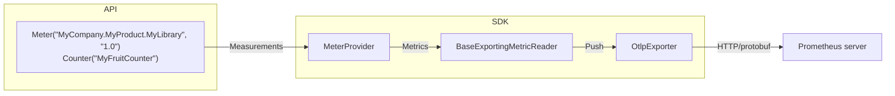

# Getting Started with Prometheus and Grafana

<details>
<summary>Table of Contents</summary>

* [Export metrics from the application](#export-metrics-from-the-application)
* [Collect metrics using Prometheus](#collect-metrics-using-prometheus)
  * [Install and run Prometheus](#install-and-run-prometheus)
  * [View results in Prometheus](#view-results-in-prometheus)
* [Explore metrics using Grafana](#explore-metrics-using-grafana)
* [Learn more](#learn-more)

</details>

## Export metrics from the application

It is highly recommended to go over the [getting started in 5 minutes - Console
Application](../getting-started-console/README.md) doc before following along
this document.

Create a new console application and run it:

```sh
dotnet new console --output getting-started-prometheus-grafana
cd getting-started-prometheus-grafana
dotnet run
```

Add reference to [OTLP
Exporter](../../../src/OpenTelemetry.Exporter.OpenTelemetryProtocol/README.md):

```sh
dotnet add package OpenTelemetry.Exporter.OpenTelemetryProtocol
```

Now copy the code from [Program.cs](./Program.cs) and run the application again.

When we ran the application, the OTLP Exporter was attempting to export the
metrics to `http://localhost:9090/api/v1/otlp/v1/metrics`. Since Prometheus
server was not running, the metrics received by `OtlpExporter` were simply
dropped on the floor. In the next step, we are going to learn about how to use
Prometheus to collect and visualize the metrics.



Also, for our learning purpose, use a while-loop to keep increasing the counter
value until any key is pressed.

```csharp
Console.WriteLine("Press any key to exit");

while (!Console.KeyAvailable)
{
    MyFruitCounter.Add(1, new("name", "apple"), new("color", "red"));
    MyFruitCounter.Add(2, new("name", "lemon"), new("color", "yellow"));
    ...

    Thread.Sleep(300);
}
```

## Collect metrics using Prometheus

### Install and run Prometheus

Follow the [first steps](https://prometheus.io/docs/introduction/first_steps/)
to download the [latest release](https://prometheus.io/download/) of Prometheus.

After finished downloading, extract it to a local location that's easy to
access. Run the `prometheus(.exe)` server executable with feature flag
[otlp-receiver](https://prometheus.io/docs/prometheus/latest/feature_flags/#otlp-receiver)
enabled:

```sh
./prometheus --web.enable-otlp-receiver
```

### View results in Prometheus

To use the graphical interface for viewing our metrics with Prometheus, navigate
to [http://localhost:9090/graph](http://localhost:9090/graph), and type
`MyFruitCounter_total` in the expression bar of the UI; finally, click the
execute button.

We should be able to see the following chart from the browser:


Congratulations!

Now we know how to configure Prometheus server and deploy OpenTelemetry
`OtlpExporter` to export our metrics. Next, we are going to explore a tool
called Grafana, which has powerful visualizations for the metrics.

## Explore metrics using Grafana

[Install Grafana](https://grafana.com/docs/grafana/latest/installation/).

Start the standalone Grafana server (`grafana-server.exe` or
`./bin/grafana-server`, depending on the operating system). Then, use the
browser to navigate to [http://localhost:3000/](http://localhost:3000/).

Follow the instructions in the Grafana getting started
[doc](https://grafana.com/docs/grafana/latest/getting-started/getting-started/#step-2-log-in)
to log in.

After successfully logging in, hover on the Configuration icon
on the panel at the left hand side, and click on Plugins.
Find and click on the Prometheus plugin. Next click on
`Create a Prometheus data source` button. Type in the default endpoint of
Prometheus as suggested by the UI as the value for the URI.

```console
http://localhost:9090
```

At the bottom of the page click `Save & test` to ensure the data source is
working. Then, click on the `Explore` button - we should be able to write
some queries to explore our metrics now!

Feel free to find some handy PromQL
[here](https://promlabs.com/promql-cheat-sheet/).

In the below example, the query targets to find out what is the per-second rate
of increase of `MyFruitCounter_total` over the past 5 minutes:


## Learn more

* [What is Prometheus?](https://prometheus.io/docs/introduction/overview/)
* [Prometheus now supports OpenTelemetry
  Metrics](https://horovits.medium.com/prometheus-now-supports-opentelemetry-metrics-83f85878e46a)
* [Grafana support for
  Prometheus](https://prometheus.io/docs/visualization/grafana/#creating-a-prometheus-graph)
