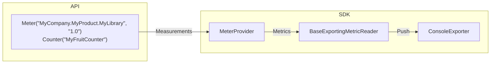

# Getting Started with OpenTelemetry .NET in 5 Minutes

First, download and install the [.NET
SDK](https://dotnet.microsoft.com/download) on your computer.

Create a new console application and run it:

```sh
dotnet new console --output getting-started
cd getting-started
dotnet run
```

You should see the following output:

```text
Hello World!
```

Install the
[OpenTelemetry.Exporter.Console](../../../src/OpenTelemetry.Exporter.Console/README.md)
package:

```sh
dotnet add package --prerelease OpenTelemetry.Exporter.Console
```

Update the `Program.cs` file with the code from [Program.cs](./Program.cs):

Run the application again (using `dotnet run`) and you should see the metric
output from the console (metrics will be seen once the program ends),
similar to shown below:

```text
Export MyFruitCounter, Meter: MyCompany.MyProduct.MyLibrary/1.0
(2021-09-23T22:00:08.4399776Z, 2021-09-23T22:00:08.4510115Z] color:red name:apple LongSum
Value: 6
(2021-09-23T22:00:08.4399776Z, 2021-09-23T22:00:08.4510115Z] color:yellow name:lemon LongSum
Value: 7
(2021-09-23T22:00:08.4399776Z, 2021-09-23T22:00:08.4510115Z] color:green name:apple LongSum
Value: 2
```

Congratulations! You are now collecting metrics using OpenTelemetry.

What does the above program do?

The program creates a
[Meter](https://github.com/open-telemetry/opentelemetry-specification/blob/main/specification/metrics/api.md#meter)
instance named "MyCompany.MyProduct.MyLibrary" and then creates a
[Counter](https://github.com/open-telemetry/opentelemetry-specification/blob/main/specification/metrics/api.md#counter)
instrument from it. This counter is used to report several metric measurements.

An OpenTelemetry
[MeterProvider](#meterprovider)
is configured to subscribe to instruments from the Meter
`MyCompany.MyProduct.MyLibrary`, and aggregate the measurements in-memory. The
pre-aggregated metrics are exported to a `ConsoleExporter`.



## MeterProvider

As shown in the above program, a valid `MeterProvider` must be configured and
built to collect metrics with OpenTelemetry .NET SDK. `MeterProvider` holds all
the configuration for metrics like `Meter` names, readers, etc. and is highly
[customizable](../customizing-the-sdk/README.md#meterprovider-configuration).

## OpenTelemetry .NET special note

Metrics in OpenTelemetry .NET is a somewhat unique implementation of the
OpenTelemetry project, as most of the
[Metrics API](https://github.com/open-telemetry/opentelemetry-specification/blob/main/specification/metrics/api.md)
is implemented by the [.NET
runtime](https://github.com/dotnet/runtime) itself. From a high level, what this
means is that you can instrument your application by simply depending on
`System.Diagnostics.DiagnosticSource` package.

## Learn more

* If you want to learn about more instruments, refer to [learning
  more about instruments](../learning-more-instruments/README.md).

* If you want to customize the Sdk, refer to [customizing
  the SDK](../customizing-the-sdk/README.md).
