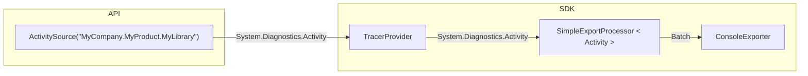

# Getting Started with OpenTelemetry .NET in 5 Minutes - Console Application

First, download and install the [.NET
SDK](https://dotnet.microsoft.com/download) on your computer.

Create a new console application and run it:

```sh
dotnet new console --output getting-started
cd getting-started
dotnet run
```

You should see the following output:

```text
Hello World!
```

Install the
[OpenTelemetry.Exporter.Console](../../../src/OpenTelemetry.Exporter.Console/README.md)
package:

```sh
dotnet add package OpenTelemetry.Exporter.Console
```

Update the `Program.cs` file with the code from [Program.cs](./Program.cs).

Run the application again (using `dotnet run`) and you should see the trace
output from the console.

```text
Activity.TraceId:          d4a7d499698d62f0e2317a67abc559b6
Activity.SpanId:           a091d18fbe45bdf6
Activity.TraceFlags:           Recorded
Activity.ActivitySourceName: MyCompany.MyProduct.MyLibrary
Activity.DisplayName: SayHello
Activity.Kind:        Internal
Activity.StartTime:   2022-03-30T19:42:33.5178011Z
Activity.Duration:    00:00:00.0097620
StatusCode : Ok
Activity.Tags:
    foo: 1
    bar: Hello, World!
    baz: [1, 2, 3]
Resource associated with Activity:
    service.name: unknown_service:getting-started
```

Congratulations! You are now collecting traces using OpenTelemetry.

What does the above program do?

The program creates an `ActivitySource` which represents an [OpenTelemetry
Tracer](https://github.com/open-telemetry/opentelemetry-specification/blob/main/specification/trace/api.md#tracer).

```csharp
private static readonly ActivitySource MyActivitySource = new ActivitySource(
    "MyCompany.MyProduct.MyLibrary");
```

The `ActivitySource` instance is used to start an `Activity` which represents an
[OpenTelemetry
Span](https://github.com/open-telemetry/opentelemetry-specification/blob/main/specification/trace/api.md#span)
and set several `Tags`, which represents
[Attributes](https://github.com/open-telemetry/opentelemetry-specification/blob/main/specification/trace/api.md#set-attributes)
on it. It also sets the [Status](https://github.com/open-telemetry/opentelemetry-specification/blob/main/specification/trace/api.md#set-status)
to be `Ok`.

```csharp
using (var activity = MyActivitySource.StartActivity("SayHello"))
{
    activity?.SetTag("foo", 1);
    activity?.SetTag("bar", "Hello, World!");
    activity?.SetTag("baz", new int[] { 1, 2, 3 });
    activity?.SetStatus(ActivityStatusCode.Ok);
}
```

An OpenTelemetry
[TracerProvider](#tracerprovider)
is configured to subscribe to the activities from the source
`MyCompany.MyProduct.MyLibrary`, and export it to `ConsoleExporter`.
`ConsoleExporter` simply displays it on the console.

```csharp
using var tracerProvider = Sdk.CreateTracerProviderBuilder()
    .AddSource("MyCompany.MyProduct.MyLibrary")
    .AddConsoleExporter()
    .Build();
```



## TracerProvider

As shown in the above program, a valid `TracerProvider` must be configured and
built to collect traces with OpenTelemetry .NET SDK. `TracerProvider` holds all
the configuration for tracing like samplers, processors, etc. and is highly
[customizable](../customizing-the-sdk/README.md#tracerprovider-configuration).

## OpenTelemetry .NET and relation with .NET Activity API

If you tried the above program, you may have already noticed that the terms
`ActivitySource` and `Activity` were used instead of `Tracer` and `Span` from
OpenTelemetry specification. This results from the fact that, Traces in
OpenTelemetry .NET is a somewhat unique implementation of the OpenTelemetry
project, as most of the [Trace
API](https://github.com/open-telemetry/opentelemetry-specification/blob/main/specification/trace/api.md)
is implemented by the [.NET runtime](https://github.com/dotnet/runtime) itself.
From a high level, what this means is that you can instrument your application
by simply depending on `System.Diagnostics.DiagnosticSource` package, which
provides `Activity` and `ActivitySource` classes representing the OpenTelemetry
concepts of
[Span](https://github.com/open-telemetry/opentelemetry-specification/blob/main/specification/trace/api.md#span)
and
[Tracer](https://github.com/open-telemetry/opentelemetry-specification/blob/main/specification/trace/api.md#tracer)
respectively. Read
[this](../../../src/OpenTelemetry.Api/README.md#introduction-to-opentelemetry-net-tracing-api)
to learn more.

## Learn more

* [Getting Started with Jaeger](../getting-started-jaeger/README.md)
* [Customizing OpenTelemetry .NET SDK](../customizing-the-sdk/README.md)
* [Extending the OpenTelemetry .NET SDK](../extending-the-sdk/README.md)
