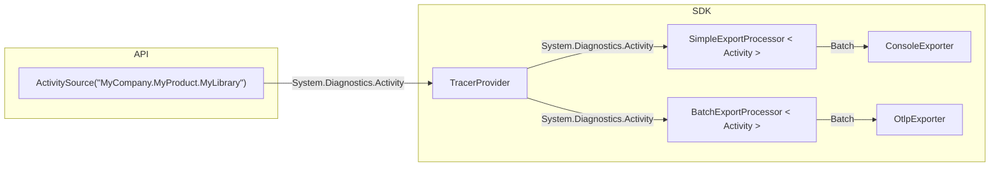
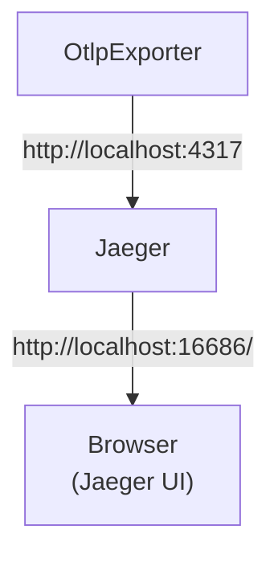
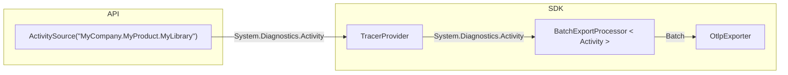

# Getting Started with Jaeger

<details>
<summary>Table of Contents</summary>

* [Export traces from the application](#export-traces-from-the-application)
  * [Check results in the console](#check-results-in-the-console)
* [Collect and visualize traces using Jaeger](#collect-and-visualize-traces-using-jaeger)
* [Final cleanup](#final-cleanup)
* [Learn more](#learn-more)

</details>

## Export traces from the application

It is highly recommended to go over the [getting started in 5 minutes - ASP.NET
Core Application](../getting-started-aspnetcore/README.md) guide or the [getting
started in 5 minutes - Console
Application](../getting-started-console/README.md) guide before following along
this document.

Create a new console application and run it:

```sh
dotnet new console --output getting-started-jaeger
cd getting-started-jaeger
dotnet run
```

Add reference to [Console
Exporter](../../../src/OpenTelemetry.Exporter.Console/README.md), [OTLP
Exporter](../../../src/OpenTelemetry.Exporter.OpenTelemetryProtocol/README.md) and
[HttpClient Instrumentation](https://github.com/open-telemetry/opentelemetry-dotnet-contrib/tree/main/src/OpenTelemetry.Instrumentation.Http/README.md):

```sh
dotnet add package OpenTelemetry.Exporter.Console
dotnet add package OpenTelemetry.Exporter.OpenTelemetryProtocol
dotnet add package OpenTelemetry.Instrumentation.Http
```

Now copy the code from [Program.cs](./Program.cs).

### Check results in the console

Run the application again and we should see the trace output from the console:

```text
> dotnet run

Activity.TraceId:            693f1d15634bfe6ba3254d6f9d20df27
Activity.SpanId:             429cc5a90a753fb3
Activity.TraceFlags:         Recorded
Activity.ParentSpanId:       0d64498b736c9a11
Activity.ActivitySourceName: System.Net.Http
Activity.DisplayName:        GET
Activity.Kind:               Client
Activity.StartTime:          2024-07-04T13:18:12.2408786Z
Activity.Duration:           00:00:02.1028562
Activity.Tags:
    http.request.method: GET
    server.address: httpstat.us
    server.port: 443
    url.full: https://httpstat.us/200?sleep=Redacted
    network.protocol.version: 1.1
    http.response.status_code: 200
Resource associated with Activity:
    service.name: DemoApp
    service.version: 1.0.0
    service.instance.id: 03ccafab-e9a7-440a-a9cd-9a0163e0d06c
    telemetry.sdk.name: opentelemetry
    telemetry.sdk.language: dotnet
    telemetry.sdk.version: 1.9.0
...
```

Note that we have configured two exporters in the code:

```csharp
using var tracerProvider = Sdk.CreateTracerProviderBuilder()
    ...
    .AddConsoleExporter()
    .AddOtlpExporter()
    .Build();
```

When we ran the application, the `ConsoleExporter` was printing the traces on
console, and the `OtlpExporter` was attempting to send the traces to Jaeger
Agent via the default endpoint `http://localhost:4317`.

Since we didn't have Jaeger running, the traces received by `OtlpExporter`
were simply dropped on the floor. In the next step, we are going to learn about
how to use Jaeger to collect and visualize the traces.



## Collect and visualize traces using Jaeger

### Install and run Jaeger

Download the [latest binary distribution
archive](https://www.jaegertracing.io/download/) of Jaeger.

After finished downloading, extract it to a local location that's easy to
access. Run the `jaeger-all-in-one(.exe)` executable:

```sh
./jaeger-all-in-one --collector.otlp.enabled
```

Now we should be able to see the Jaeger UI at
[http://localhost:16686/](http://localhost:16686/) from a web browser:


Run the application again and refresh the web page, we should be able to see the
traces now:


Click on the individual trace to see the [Gantt
Chart](https://en.wikipedia.org/wiki/Gantt_chart):




## Final cleanup

In the end, remove the Console Exporter so we only have OTLP Exporter in the
final application:

```csharp
using var tracerProvider = Sdk.CreateTracerProviderBuilder()
    ...
    // Remove Console Exporter from the final application
    // .AddConsoleExporter()
    .AddOtlpExporter()
    .Build();
```

```sh
dotnet remove package OpenTelemetry.Exporter.Console
```



## Learn more

* [Jaeger Tracing](https://www.jaegertracing.io/)
* [OTLP Exporter for OpenTelemetry
  .NET](../../../src/OpenTelemetry.Exporter.OpenTelemetryProtocol/README.md)
