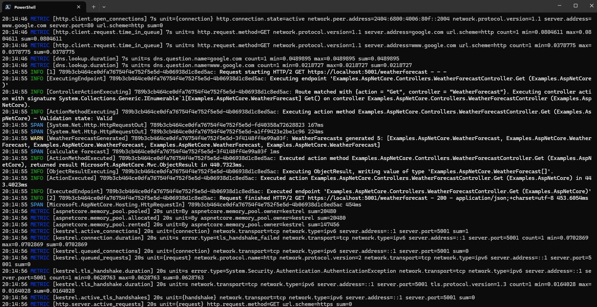

# Console Exporter for OpenTelemetry .NET

[](https://www.nuget.org/packages/OpenTelemetry.Exporter.Console)
[](https://www.nuget.org/packages/OpenTelemetry.Exporter.Console)

The console exporter prints data to the Console window.
ConsoleExporter supports exporting logs, metrics and traces.

> [!WARNING]
> This exporter is intended for debugging and learning purposes. It is not
  recommended for production use. The output format is not standardized and can
  change at any time.
  If a standardized format for exporting telemetry to stdout is desired, upvote
  on [this feature request](https://github.com/open-telemetry/opentelemetry-dotnet/issues/5920).

## Installation

```shell
dotnet add package OpenTelemetry.Exporter.Console
```

See the individual "getting started" examples depending on the signal being
used:

* Logs: [ASP.NET Core](../../docs/logs/getting-started-aspnetcore/README.md) |
  [Console](../../docs/logs/getting-started-console/README.md)
* Metrics: [ASP.NET
  Core](../../docs/metrics/getting-started-aspnetcore/README.md) |
  [Console](../../docs/metrics/getting-started-console/README.md)
* Traces: [ASP.NET Core](../../docs/trace/getting-started-aspnetcore/README.md)
  | [Console](../../docs/trace/getting-started-console/README.md)

## Formatters

There are two formatters provided.

The `Detail` formatter has multi-line output, dumping out the most of the
OpenTelemetry details. Use this format for learning about OpenTelemetry, or
for development of the OpenTelemetry libraries.

The `Compact` formatter shows basic information, as a single line, in a
coloured format. This is suitable for use during application development as a
replacement for the .NET console logger provider, allowing you to run an
OpenTelemetry only stack.

If using the 'Compact' formatter, it is recommended to also use local OTLP
native services, such as Loki, Jaeger, and Prometheus, for full telemetry
details.

> [!WARNING]
> This is not designed for production use, but is usable for development.

## Running examples

The example projects includes simple console examples for output of logs,
spans, and metrics. The example configuration uses the alternative
'Compact' logger.

```powershell
dotnet run --project examples/Console/Examples.Console.csproj -- logs --useExporter console
dotnet run --project examples/Console/Examples.Console.csproj -- console
dotnet run --project examples/Console/Examples.Console.csproj -- metrics
```

If you want to run with the 'Detail' formatter, then you can pass it
via the command line:

```powershell
dotnet run --project examples/Console/Examples.Console.csproj -- logs --useExporter console --useFormatter detail
```

For an integrated example that includes all telemetry types in an ASP.NET
application, use:

```powershell
dotnet run --project examples/AspNetCore/Examples.AspNetCore.csproj
```

Then use a browser to request `https://localhost:5001/weatherforecast`



## Configuration

See the
[`TestConsoleExporter.cs`](../../examples/Console/TestConsoleExporter.cs) for
an example of how to use the exporter for exporting traces to a collection.

You can configure the `ConsoleExporter` through `Options` types properties
and environment variables.
The `Options` type setters take precedence over the environment variables.

| Option | Description |
| -- | -- |
| Formatter | Default is the "Detail" formatter; use "Compact" for single line. |
| Targets | Default is "Console"; can also specify "Debug". (for KeyValue formatter) |
| TimestampFormat | Default is "HH:mm:ss ". If empty, no timestamp is output. (for Simple formatter) |
| UseUtcTimestamp | Default is false (output local time). (for Simple formatter) |

### MetricReaderOptions (metrics)

For metrics, `AddConsoleExporter()` pairs the exporter with a
`PeriodicExportingMetricReader`. Use `MetricReaderOptions` to configure
temporality and export interval/timeout:

```csharp
var meterProvider = Sdk.CreateMeterProviderBuilder()
    // rest of config not shown here.
    .AddConsoleExporter((_, metricReaderOptions) =>
    {
        metricReaderOptions.TemporalityPreference = MetricReaderTemporalityPreference.Delta;

        metricReaderOptions.PeriodicExportingMetricReaderOptions.ExportIntervalMilliseconds = 10_000;
        metricReaderOptions.PeriodicExportingMetricReaderOptions.ExportTimeoutMilliseconds = 5_000;
    })
    .Build();
```

See [`TestMetrics.cs`](../../examples/Console/TestMetrics.cs) for a runnable
example.

### Environment Variables

The following environment variables can be used to override the default
values of the `PeriodicExportingMetricReaderOptions`
(following the [OpenTelemetry specification](https://github.com/open-telemetry/opentelemetry-specification/blob/main/specification/configuration/sdk-environment-variables.md#periodic-exporting-metricreader)).

| Environment variable          | `PeriodicExportingMetricReaderOptions` property |
| ------------------------------| ------------------------------------------------|
| `OTEL_METRIC_EXPORT_INTERVAL` | `ExportIntervalMilliseconds`                    |
| `OTEL_METRIC_EXPORT_TIMEOUT`  | `ExportTimeoutMilliseconds`                     |

## Future features

See issue [#6391](https://github.com/open-telemetry/opentelemetry-dotnet/issues/6391)
for original list.

Potential features:

* Custom formatting.
* Colourisation of semantic logging values (when injected into the message template/body)
* Filtering of messages, e.g. only certain logs/traces/metrics
* Filtering of frequency. e.g. metrics may want to output once per minute or something
* Support additional output attributes (the equivalent of the .NET supporting
  output scopes)
* Filtering of additional attributes to output
* Support resource details output -- for OTLP resource is included with each
  message, and often stored in a mixed database of distributed traces; however
  a console output will only be one component, so no need to repeat each time.
  e.g. could just output once from the first received record.

Potential related or longer term features and formats:

* ANSI console support
* Separating formatting from the actual output
* JSON output (including OTLP JSONL formatting)
* OTEL standard console output (which might end up being OTLP JSON)
* Production-level performance (the simple console is designed for a developer)
* File output (including the many variations like file rotation)
* Syslog format (like .NET console logger provider has)
* YAML (or other structured) output

## References

* [OpenTelemetry Project](https://opentelemetry.io/)
