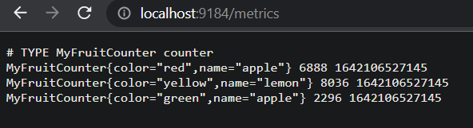
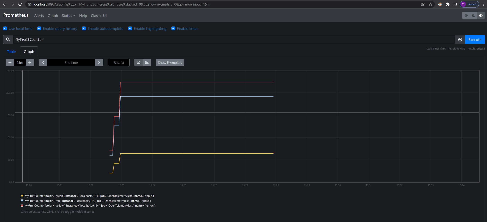

# Application monitoring with OpenTelemetry .NET PrometheusExporter via Prometheus and Grafana

[](https://www.nuget.org/packages/OpenTelemetry.Exporter.Prometheus)
[](https://www.nuget.org/packages/OpenTelemetry.Exporter.Prometheus)

- [Application monitoring with OpenTelemetry .NET PrometheusExporter via Prometheus and Grafana](#application-monitoring-with-opentelemetry-net-prometheusexporter-via-prometheus-and-grafana)
  - [Introduction](#introduction)
  - [Get Prometheus](#get-prometheus)
  - [PrometheusExporter HTTP server](#prometheusexporter-http-server)
    - [Configuration](#configuration)
    - [Start Prometheus](#start-prometheus)
    - [Configure OpenTelemetry to expose metrics to Prometheus endpoint](#configure-opentelemetry-to-expose-metrics-to-prometheus-endpoint)
    - [Check results in Prometheus](#check-results-in-prometheus)
    - [View/Query results with Grafana](#viewquery-results-with-grafana)
  - [Configure PrometheousExporter middleware](#configure-prometheousexporter-middleware)
    - [Configure Prometheus Scraping Endpoint](#configure-prometheus-scraping-endpoint)
  - [Configuration](#configuration-1)
  - [Options Properties](#options-properties)
  - [References](#references)


## Introduction
* [What is Prometheus?](https://prometheus.io/docs/introduction/overview/)
* [Grafana support for Prometheus](https://prometheus.io/docs/visualization/grafana/#creating-a-prometheus-graph)
## Get Prometheus
Follow the first steps in [this]((https://prometheus.io/docs/introduction/first_steps/)) document.

## PrometheusExporter HTTP server
### Configuration

After downloading the [latest release](https://prometheus.io/download/), extract it to a local location of your liking. You will find the default prometheus configuration yaml file in the folder, named prometheus.yml. 

Replace all the content with:
```
global:
  scrape_interval: 10s
  scrape_timeout: 10s
  evaluation_interval: 10s
scrape_configs:
- job_name: OpenTelemetryTest
  honor_timestamps: true
  scrape_interval: 1s
  scrape_timeout: 1s
  metrics_path: /metrics
  scheme: http
  follow_redirects: true
  static_configs:
  - targets:
    - localhost:9184
```

### Start Prometheus
Follow the instructions [here](https://prometheus.io/docs/introduction/first_steps/#starting-prometheus) to start and verify prometheus server has been started successfully.

Next, we are going to make some small tweaks to [Program.cs](../../docs/metrics/getting-started/Program.cs)
to export our metrics to the endpoint that prometheus was configured to listen to.

### Configure OpenTelemetry to expose metrics to Prometheus endpoint 

Create a new console application and run it:

```sh
dotnet new console --output prometheus-http-server
cd prometheus-http-server
dotnet run
```

We will have to add a reference to Prometheus exporter to the prometheus-http-server application.

```shell
dotnet add package OpenTelemetry.Exporter.Prometheus --version 1.2.0-rc1
```

Now, replace everything in `Program.cs` with:

```csharp
using System;
using System.Diagnostics.Metrics;
using System.Threading;
using OpenTelemetry;
using OpenTelemetry.Metrics;

public class Program
{
    private static readonly Meter MyMeter = new Meter("MyCompany.MyProduct.MyLibrary", "1.0");
    private static readonly Counter<long> MyFruitCounter = MyMeter.CreateCounter<long>("MyFruitCounter");

    public static void Main(string[] args)
    {
        using var meterProvider = Sdk.CreateMeterProviderBuilder()
            .AddMeter("MyCompany.MyProduct.MyLibrary")
            .AddPrometheusExporter(opt =>
            {
                opt.StartHttpListener = true;
                opt.HttpListenerPrefixes = new string[] { $"http://localhost:9184/" };
            })
            .Build();

        Console.WriteLine("Press any key to exit");
        while (!Console.KeyAvailable)
        {
            Thread.Sleep(1000);
            MyFruitCounter.Add(1, new("name", "apple"), new("color", "red"));
            MyFruitCounter.Add(2, new("name", "lemon"), new("color", "yellow"));
            MyFruitCounter.Add(1, new("name", "lemon"), new("color", "yellow"));
            MyFruitCounter.Add(2, new("name", "apple"), new("color", "green"));
            MyFruitCounter.Add(5, new("name", "apple"), new("color", "red"));
            MyFruitCounter.Add(4, new("name", "lemon"), new("color", "yellow"));
        }
    }
}
```
### Check results in Prometheus
Run the application and leave the process running in the background. 
Now we should be able to see the metrics at the endpoint we've configured in `prometheus.yml` file and the defined in `Program.cs`; in this case, the value is: "http://localhost:9184/". 

Check the output metrics with your favorite browser:



To use the graphical interface for viewing your metrics with Prometheus, navigate to "http://localhost:9090/graph", insert MyFruitCounter we've created into the expression bar, and click execute. We should be able to see the following chart:



Congratulations!

Now we know how to configure prometheus http server and deploy OpenTelemetry prometheusExporter to export our metrics. Next, we are going to explore a tool called Grafana, which has powerful visualizations and  for the metrics.
### View/Query results with Grafana

[Install Grafana](https://grafana.com/docs/grafana/latest/installation/)
For windows users, after finished installation, start the standalone Graphana server, grafana-server.exe located in the bin folder. Then go to the default Grafana port 3000, we can confirm the port number with the logs from the command line as well. And follow the instructions [here](https://grafana.com/docs/grafana/latest/getting-started/getting-started/#step-2-log-in) for logging in.

After successfully logged in, hit on the explore option on the left panel, we should be able to write some queries to explore our metrics now!

[Here](https://promlabs.com/promql-cheat-sheet/) is a list of PromQL to begin with.

In the below example, the query targeted to find out what is the per-second rate of increace for myFruitCounter metrics over the last 30 minutes:


## Configure PrometheousExporter middleware

* When using OpenTelemetry.Extensions.Hosting package on .NET Core 3.1+:

    ```csharp
    services.AddOpenTelemetryMetrics(builder =>
    {
        builder.AddPrometheusExporter();
    });
    ```

### Configure Prometheus Scraping Endpoint

* On .NET Core 3.1+ register Prometheus scraping middleware using the
  `UseOpenTelemetryPrometheusScrapingEndpoint` extension:

    ```csharp
    public void Configure(IApplicationBuilder app, IWebHostEnvironment env)
    {
        app.UseRouting();
        app.UseOpenTelemetryPrometheusScrapingEndpoint();
        app.UseEndpoints(endpoints =>
        {
            endpoints.MapControllers();
        });
    }
    ```

* On .NET Framework an http listener is automatically started which will respond
  to scraping requests. See the [Options Properties](#options-properties)
  section for details on the settings available. This may also be turned on in
  .NET Core (it is OFF by default) when the ASP.NET Core pipeline is not
  available for middleware registration.

## Configuration

You can configure the `PrometheusExporter` through `PrometheusExporterOptions`.

## Options Properties

The `PrometheusExporter` can be configured using the `PrometheusExporterOptions`
properties:

* `StartHttpListener`: Set to `true` to start an http listener which will
  respond to Prometheus scrape requests using the `HttpListenerPrefixes` and
  `ScrapeEndpointPath` options.

  Defaults:

  * On .NET Framework this is `true` by default.

  * On .NET Core 3.1+ this is `false` by default. Users running ASP.NET Core
    should use the `UseOpenTelemetryPrometheusScrapingEndpoint` extension to
    register the scraping middleware instead of using the listener.

* `HttpListenerPrefixes`: Defines the prefixes which will be used by the
  listener when `StartHttpListener` is `true`. The default value is
  `["http://*:80/"]`. You may specify multiple endpoints.

  For details see:
  [HttpListenerPrefixCollection.Add(String)](https://docs.microsoft.com/dotnet/api/system.net.httplistenerprefixcollection.add)

* `ScrapeEndpointPath`: Defines the path for the Prometheus scrape endpoint for
  either the http listener or the middleware registered by
  `UseOpenTelemetryPrometheusScrapingEndpoint`. Default value: `"/metrics"`.

* `ScrapeResponseCacheDurationMilliseconds`: Configures scrape endpoint response
  caching. Multiple scrape requests within the cache duration time period will
  receive the same previously generated response. The default value is `10000`
  (10 seconds). Set to `0` to disable response caching.

See
[`TestPrometheusExporter.cs`](../../examples/Console/TestPrometheusExporter.cs)
for example use.

## References

* [OpenTelemetry Project](https://opentelemetry.io/)
* [Prometheus](https://prometheus.io)
